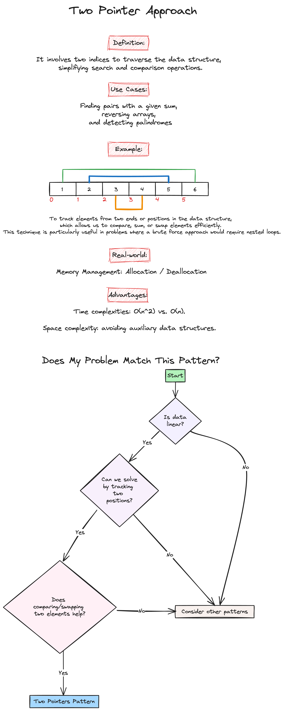
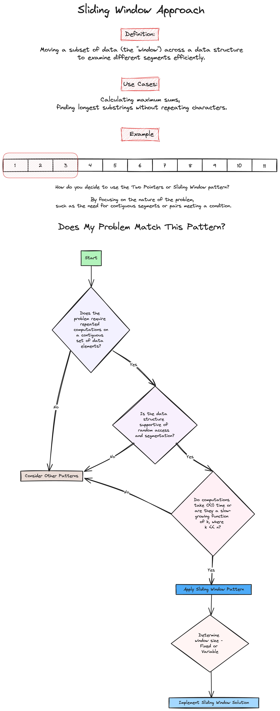

# Week 1: Lists, Arrays, and Sorting

Welcome to the first week of our LeetCode Bootcamp. This week, we will dive into Lists, Arrays, and Sorting in Python, alongside introducing powerful problem-solving patterns like the Two-Pointer Approach and the Sliding Window Technique.

## Class Agenda (2 Hours)

### 1. Overview of the Bootcamp Syllabus

- Introduction to the course structure
- Objectives and outcomes

### 2. Python Overview of Lists, Arrays, and Sorting

Please review the following resources:

- [Exercism: Python Lists](https://exercism.org/tracks/python/concepts/lists)
- [Python.org: List Comprehensions](https://docs.python.org/3/tutorial/datastructures.html#list-comprehensions)
- [Python.org: Sequence Types - list, tuple, range](https://docs.python.org/3/library/stdtypes.html#sequence-types-list-tuple-range)
- [Python.org: Sorting HOW TO](https://docs.python.org/3/howto/sorting.html#)
- [Real Python: Python Lists and Tuples](https://realpython.com/python-lists-tuples/)

### 3. Pattern Introduction

- Two-Pointer Approach

- Sliding Window Technique


### 4. Problems Covered This Week

- [Best time to buy and sell stock](https://leetcode.com/problems/best-time-to-buy-and-sell-stock/)(Easy)

```python
class Solution:
    def maxProfit(self, prices: List[int]) -> int:
    
    # Brute Force Approach

        max_profit = 0
        n = len(prices)
        for i in range(n):
            for j in range(i+1, n):
                profit = prices[j] - prices[i]
                if profit > max_profit:
                    max_profit = profit
        return max_profit

    # Time Complexity: O(n^2), where n is the number of days (two nested loops).
    # Space Complexity: O(1), as we're only using a fixed amount of extra space.

    # Two Pointer Approach

        min_price = float('inf')
        max_profit = 0
        for price in prices:
            if price < min_price:
                min_price = price  # Update min_price if current price is lower
            elif price - min_price > max_profit:
                max_profit = price - min_price  # Update max_profit if current profit is higher
        return max_profit

    # Time Complexity: O(n), where n is the number of days. We only need to traverse the list once.
    # Space Complexity: O(1), as we're only using a fixed amount of extra space.
```

- [Sort Colors](https://leetcode.com/problems/sort-colors/)(Medium)

```python
class Solution:
    def sortColors(self, nums: List[int]) -> None:
    
        # Two Pointer Approach
        red, white, blue = 0, 0, len(nums) - 1
        
        while white <= blue:
            if nums[white] == 0:
                if nums[red] != 0:
                    nums[red], nums[white] = nums[white], nums[red]
                
                white += 1
                red += 1

            elif nums[white] == 1:
                white += 1

            else:
                if nums[blue] != 2:
                    nums[white], nums[blue] = nums[blue], nums[white]

                blue -= 1

        return nums

        # Time complexity: O(n), since we’re only traversing the array once.
        # Space complexity: O(1), since no extra space is used.
```

- [Sliding Window Maximum](https://leetcode.com/problems/sliding-window-maximum/)(Hard)

```python
class Solution:
    def maxSlidingWindow(self, nums: List[int], k: int) -> List[int]:
        # Initialize the result list
        res = []

        for i in range(len(nums) - k + 1):
            # Find the maximum value in the current window and append to res
            max_val = max(nums[i:i+k])
            res.append(max_val)

        return res

        # Time Complexity: O(n*k), where n is the number of elements in the array and k is the window size.
        # Space Complexity: O(n), where n is the number of elements in the array, accounting for the space needed to store the result for each window.
```

## Take-Home Problems

To help solidify your understanding and practice further, here are some take-home problems:

1. [Contains Duplicate](https://leetcode.com/problems/contains-duplicate/)(Easy)
2. [Video Stitching](https://leetcode.com/problems/video-stitching/)(Medium)
3. [Container With Most Water](https://leetcode.com/problems/container-with-most-water/)(Medium)

Good luck, and happy coding!
