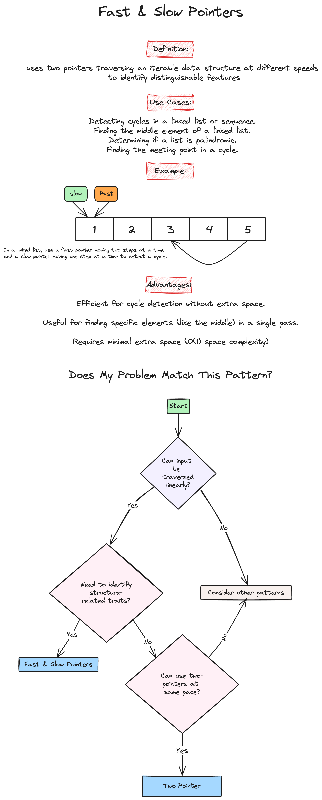
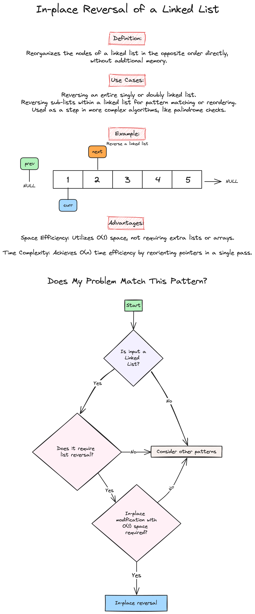
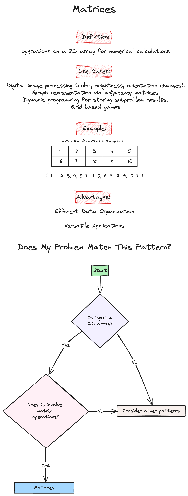

# Week 3: Linked Lists & Matrices

Welcome to the third week of our LeetCode Bootcamp. This week, we will dive into Linked Lists and Matrices in Python, alongside introducing powerful problem-solving patterns.

## Class Agenda (2 Hours)

### 1. Python Overview of Linked Lists and Matrices

Please review the following resources:

- [Programiz: Linked List](https://www.programiz.com/dsa/linked-list)
- [Datacamp: Linked List](https://www.datacamp.com/tutorial/python-linked-lists)
- [Programiz: Matrix](https://www.programiz.com/python-programming/matrix)
- [Python.org: List Data Structure](https://docs.python.org/3/tutorial/datastructures.html)

### 2. Pattern Introduction

- Fast and Slow Pointers 

- In-place Reversal of a Linked List 

- Matrices 

### 3. Problems Covered This Week

- [Palindrome Linked List](https://leetcode.com/problems/palindrome-linked-list/description/)(Easy)

```python
class Solution:
    def isPalindrome(self, head: Optional[ListNode]) -> bool:
        if not head or not head.next:
            return True

        # Step 1: Find the middle of the linked list
        slow = fast = head
        while fast and fast.next:
            slow = slow.next
            fast = fast.next.next

        # Step 2: Reverse the second half of the linked list
        prev = None
        curr = slow
        while curr:
            next_node = curr.next
            curr.next = prev
            prev = curr
            curr = next_node

        # Step 3: Compare the first half with the reversed second half
        first_half = head
        second_half = prev
        while second_half:
            if first_half.val != second_half.val:
                return False
            first_half = first_half.next
            second_half = second_half.next

        return True

# Time complexity: O(n), where n is the number of nodes in the linked list.

# Space complexity: O(1) since we only use a constant amount of extra space for the pointers.
```

- [Reorder List](https://leetcode.com/problems/reorder-list/description/)(Medium)

```python
class Solution:
    def reorderList(self, head: Optional[ListNode]) -> None:
        """
        Do not return anything, modify head in-place instead.
        """
        if not head:
            return head

        # Find the middle of the linked list using the fast and slow pointers
        slow = fast = head
        while fast and fast.next:
            slow = slow.next
            fast = fast.next.next

        # Reverse the second half of the linked list using in-place reversal
        prev, curr = None, slow
        while curr:
            curr.next, prev, curr = prev, curr, curr.next

        # Merge the first half and the reversed second half
        first, second = head, prev
        while second.next:
            first.next, first = second, first.next
            second.next, second = first, second.next

        return head

# Time complexity: O(n), where n is the number of nodes in the linked list.

# Space complexity: O(1) since we only use a constant amount of extra space for the pointers.
```

- [Set Matrix Zeroes](https://leetcode.com/problems/set-matrix-zeroes/description/)(Medium)

```python
class Solution:
    def setZeroes(self, matrix: List[List[int]]) -> None:
        m = len(matrix)
        n = len(matrix[0])
        
        # Flag to check if the first column needs to be set to zero
        first_col = False
        
        # Use the first row and first column to store the zero information
        for i in range(m):
            if matrix[i][0] == 0:
                first_col = True
            for j in range(1, n):
                if matrix[i][j] == 0:
                    matrix[i][0] = matrix[0][j] = 0
        
        # Set the elements to zero based on the stored information
        for i in range(1, m):
            for j in range(1, n):
                if matrix[i][0] == 0 or matrix[0][j] == 0:
                    matrix[i][j] = 0
        
        # Set the first row to zero if necessary
        if matrix[0][0] == 0:
            for j in range(n):
                matrix[0][j] = 0
        
        # Set the first column to zero if necessary
        if first_col:
            for i in range(m):
                matrix[i][0] = 0
        
        return matrix

# Time complexity: O(m * n), where m and n are the number of rows and columns in the matrix, respectively.

# Space complexity: O(1) 
```

- [Rotate Image](https://leetcode.com/problems/rotate-image/description/)(Medium)

```python
class Solution:
    def rotate(self, matrix: List[List[int]]) -> None:
        n = len(matrix)
        
        # Step 1: Transpose the matrix
        for i in range(n):
            for j in range(i, n):
                matrix[i][j], matrix[j][i] = matrix[j][i], matrix[i][j]
        
        # Step 2: Reverse each row
        for i in range(n):
            matrix[i] = matrix[i][::-1]
        
        return matrix

# Time complexity:  O(n), where n is the size of the matrix.

# Space complexity: O(1)
```

## Take-Home Problems

To help solidify your understanding and practice further, here are some take-home problems:

1. [Middle of the Linked List](https://leetcode.com/problems/middle-of-the-linked-list/description/)(Easy)
2. [Reverse nodes in k-group](https://leetcode.com/problems/reverse-nodes-in-k-group/description/)(Hard)
3. [Valid Sudoku](https://leetcode.com/problems/valid-sudoku/description/)(Medium)

Good luck, and happy coding!
