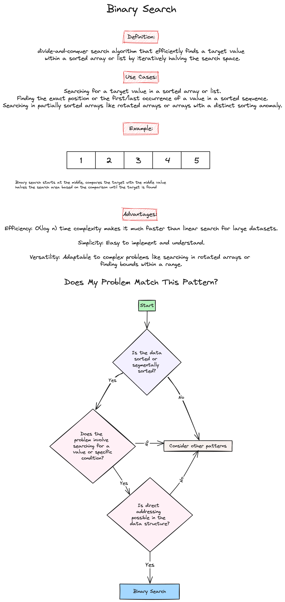

# Week 6: Search Algorithms: Binary Search, DFS, BFS, BST

Welcome to the sixth week of our LeetCode Bootcamp. This week, we will dive into Search Algorithms DFS, BFS, BST in Python, alongside introducing powerful problem-solving patterns.

## Class Agenda (2 Hours)

### 1. Python Overview of Search Algorithms: Binary Search, DFS, BFS, BST

Please review the following resources:

- [Programiz: Binary Search](https://www.programiz.com/dsa/binary-search)
- [Programiz: DFS](https://www.programiz.com/dsa/graph-dfs)
- [Programiz: BFS](https://www.programiz.com/dsa/graph-bfs)
- [Programiz: BST](https://www.programiz.com/dsa/binary-search-tree)

### 2. Pattern Introduction

- Modified Binary Search 
- Tree Depth-first Search 
- Tree Breadth-first Search 

### 3. Problems Covered This Week

- [Search in Rotated Sorted Array](https://leetcode.com/problems/search-in-rotated-sorted-array/description/)(Medium)

```python
class Solution:
    def search(self, nums: List[int], target: int) -> int:
        n = len(nums)
        left, right = 0, n - 1
        
        while left <= right:
            mid = left + (right - left) // 2
            
            # Case 1: find target
            if nums[mid] == target:
                return mid
            
            # Case 2: subarray on mid's left is sorted
            elif nums[mid] >= nums[left]:
                if target >= nums[left] and target < nums[mid]:
                    right = mid - 1
                else:
                    left = mid + 1
                    
            # Case 3: subarray on mid's right is sorted.
            else:
                if target <= nums[right] and target > nums[mid]:
                    left = mid + 1
                else:
                    right = mid - 1
        return -1

# Time complexity: O(log⁡ n) This algorithm only requires one binary search over nums.

# Space complexity: O(1) We only need to update several parameters left, right and mid.
```

- [Deepest Leaves Sum](https://leetcode.com/problems/deepest-leaves-sum/description/)(Medium)

```python
class Solution:
    def deepestLeavesSum(self, root: TreeNode) -> int:
        # Iterative DFS Preorder Traversal
        
        deepest_sum = depth = 0
        stack = [(root, 0) ]
        
        while stack:
            node, curr_depth = stack.pop()
            if node.left is None and node.right is None:
                # if this leaf is the deepest one seen so far
                if depth < curr_depth:
                    deepest_sum = node.val      # start new sum
                    depth = curr_depth          # note new depth
                # if there were already leaves at this depth
                elif depth == curr_depth:
                    deepest_sum += node.val     # update existing sum
                    
            else:
                if node.right:
                    stack.append((node.right, curr_depth + 1))
                if node.left:
                    stack.append((node.left, curr_depth + 1))
                        
        return deepest_sum

# Time complexity: O(N) since one has to visit each node.

# Space complexity: up to O(H) to keep the stack, where H is a tree height.

        # Iterative BFS Traversal

        deepest_sum = depth = 0
        queue = deque([(root, 0),])

        while queue:
            node, curr_depth = queue.popleft()
            if node.left is None and node.right is None:
                # if this leaf is the deepest one seen so far
                if depth < curr_depth:
                    deepest_sum = node.val      # start new sum
                    depth = curr_depth          # note new depth
                # if there were already leaves at this depth
                elif depth == curr_depth:
                    deepest_sum += node.val     # update existing sum    
            else:
                if node.left:
                    queue.append((node.left, curr_depth + 1))
                if node.right:
                    queue.append((node.right, curr_depth + 1))
                        
        return deepest_sum

# Time complexity: O(N) since one has to visit each node.

# Space complexity: up to O(N) to keep the Queue.
        
        # Optimized Iterative BFS Traversal.

        next_level = deque([root,])
        
        while next_level:
            # prepare for the next level
            curr_level = next_level
            next_level = deque()
            
            for node in curr_level:
                # add child nodes of the current level
                # in the queue for the next level
                if node.left:
                    next_level.append(node.left)
                if node.right:
                    next_level.append(node.right)
        
        return sum([node.val for node in curr_level])

# Time complexity: O(N) since one has to visit each node.

# Space complexity: up to O(N) to keep the Queue.
```

- [Rotting oranges](https://leetcode.com/problems/rotting-oranges/description/)(Medium)

```python
class Solution:
    def orangesRotting(self, grid: List[List[int]]) -> int:
        ROWS, COLS = len(grid), len(grid[0])
        # run the rotting process, by marking the rotten oranges with the timestamp
        directions = [(-1, 0), (0, 1), (1, 0), (0, -1)]

        def runRottingProcess(timestamp):
            # flag to indicate if the rotting process should be continued
            to_be_continued = False
            for row in range(ROWS):
                for col in range(COLS):
                    if grid[row][col] == timestamp:
                        # current contaminated cell
                        for d in directions:
                            n_row, n_col = row + d[0], col + d[1]
                            if ROWS > n_row >= 0 and COLS > n_col >= 0:
                                if grid[n_row][n_col] == 1:
                                    # this fresh orange would be contaminated next
                                    grid[n_row][n_col] = timestamp + 1
                                    to_be_continued = True
            return to_be_continued

        timestamp = 2
        while runRottingProcess(timestamp):
            timestamp += 1
        # end of process, to check if there are still fresh oranges left
        for row in grid:
            for cell in row:
                if cell == 1:  # still got a fresh orange left
                    return -1
        # return elapsed minutes if no fresh orange left
        return timestamp - 2 

# Time Complexity: O(N^2 M^2) where N×M is the size of the input grid.

# Space Complexity: O(1), the memory usage is constant regardless the size of the input.
```

- [Validate Binary Search Tree](https://leetcode.com/problems/validate-binary-search-tree/description/)(Medium)

```python
class Solution:
    def isValidBST(self, root: TreeNode) -> bool:

# Approach 1: Recursive Traversal with Valid Range

        def validate(node, low=-math.inf, high=math.inf):
            # Empty trees are valid BSTs.
            if not node:
                return True

            # The current node's value must be between low and high.
            if node.val <= low or node.val >= high:
                return False

            # The left and right subtree must also be valid.
            return (validate(node.right, node.val, high) and
                   validate(node.left, low, node.val))

        return validate(root)

# Time complexity: O(N) since we visit each node exactly once.
# Space complexity: O(N) since we keep up to the entire tree.

# Approach 2: Iterative Traversal with Valid Range

        if not root:
            return True

        stack = [(root, -math.inf, math.inf)]
        while stack:
            root, lower, upper = stack.pop()
            if not root:
                continue
            val = root.val
            if val <= lower or val >= upper:
                return False
            stack.append((root.right, val, upper))
            stack.append((root.left, lower, val))
        return True

# Time complexity: O(N) since we visit each node exactly once.
# Space complexity: O(N) since we keep up to the entire tree.

# Approach 3: Recursive Inorder Traversal

        def inorder(root):
            if not root:
                return True
            if not inorder(root.left):
                return False
            if root.val <= self.prev:
                return False
            self.prev = root.val
            return inorder(root.right)

        self.prev = -math.inf
        return inorder(root)

# Time complexity: O(N) in the worst case when the tree is a BST or the "bad" element is a rightmost leaf.
# Space complexity: O(N) for the space on the run-time stack.

# Approach 4: Iterative Inorder Traversal

        stack, prev = [], -math.inf

        while stack or root:
            while root:
                stack.append(root)
                root = root.left
            root = stack.pop()

            # If next element in inorder traversal
            # is smaller than the previous one
            # that's not BST.
            if root.val <= prev:
                return False
            prev = root.val
            root = root.right

        return True

# Time complexity: O(N) in the worst case when the tree is a BST or the "bad" element is a rightmost leaf.
# Space complexity: O(N) for the space on the run-time stack.
```

## Take-Home Problems

To help solidify your understanding and practice further, here are some take-home problems:

1. [Binary Tree Right Side View](https://leetcode.com/problems/binary-tree-right-side-view/description/)(Medium)
2. [Longest increasing path in a matrix](https://leetcode.com/problems/longest-increasing-path-in-a-matrix/description/)(Hard)
3. [Kth Smallest Element in a BST](https://leetcode.com/problems/kth-smallest-element-in-a-bst/description/)(Medium)

Good luck, and happy coding!
