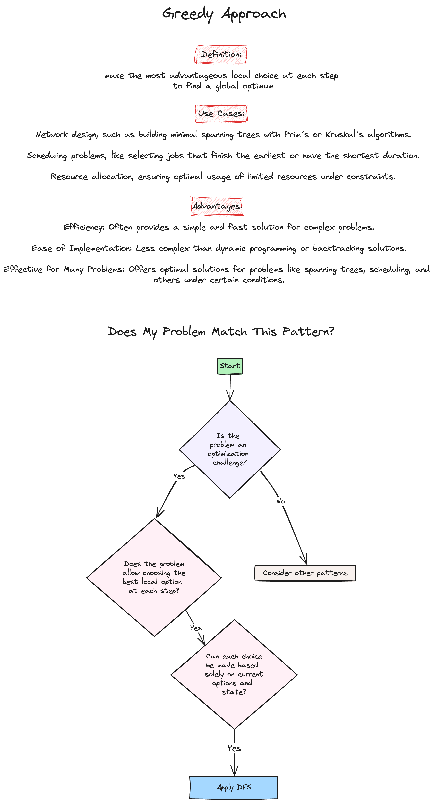
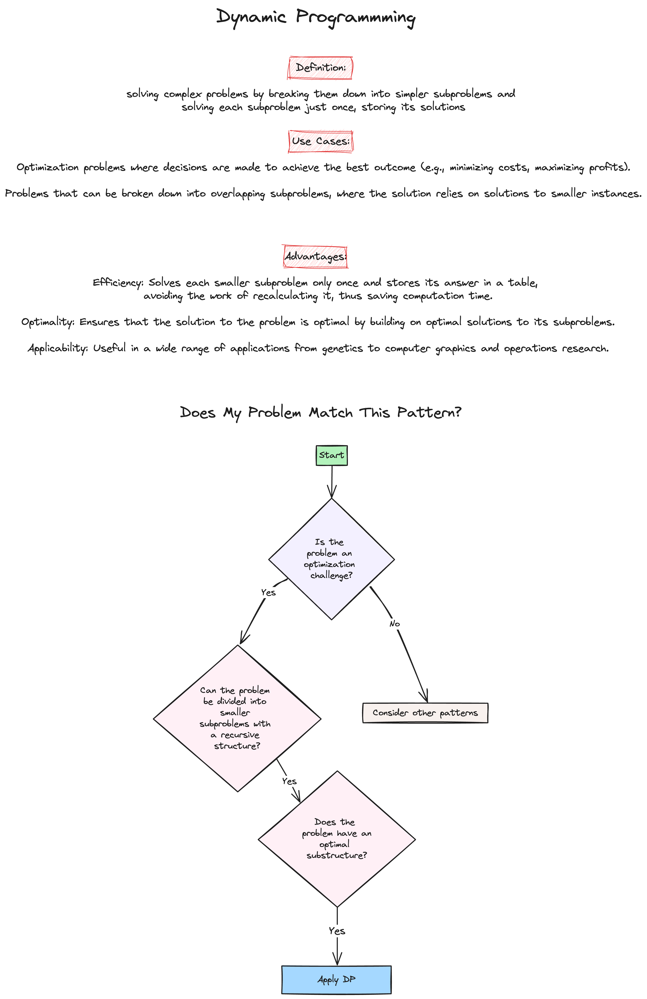
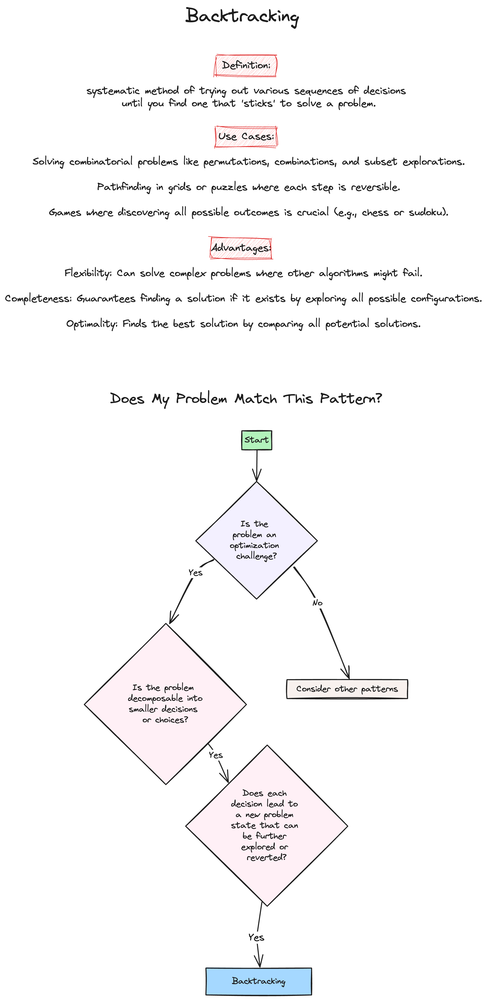

# Week 7: Dynamic Programming & Greedy Algorithms

Welcome to the final week of our LeetCode Bootcamp. This week, we will dive into Dynamic Programming & Greedy Algorithms in Python, alongside introducing powerful problem-solving patterns.

## Class Agenda (2 Hours)

### 1. Python Overview of Search Algorithms: Binary Search, DFS, BFS, BST

Please review the following resources:

- [Programiz: Greedy Algorithm](https://www.programiz.com/dsa/greedy-algorithm)
- [Programiz: Dynamic Programming](https://www.programiz.com/dsa/dynamic-programming)
- [Programiz: Backtracking](https://www.programiz.com/dsa/backtracking-algorithm)

### 2. Pattern Introduction

- Greedy Algorithm 
- Dynamic Programming 
- Backtracking 

### 3. Problems Covered This Week

- [Climbing Stairs](https://leetcode.com/problems/climbing-stairs/description/)(Easy)

```python
class Solution:
    def climbStairs(self, n: int) -> int:
        # Base cases
        if n <= 1:
            return 1

        # Recursive call for 1 step and 2 steps
        return self.climbStairs(n - 1) + self.climbStairs(n - 2)

# Time complexity : O(2^n): Each call to climbStairs results in two more calls, leading to an exponential number of calls.
# Space complexity : The depth of the recursion tree can go up to n, which dictates the space used on the call stack.

    # Tabulation (Bottom-Up Approach)
        if n <= 1:
            return 1  

        dp = [0] * (n + 1)
        dp[0], dp[1] = 1, 1
        for i in range(2, n + 1):
            dp[i] = dp[i - 1] + dp[i - 2]
        return dp[n]

# Time complexity : O(n). You only iterate through the numbers up to n once, and for each, you perform a constant amount of work.
# Space complexity : O(n) You store the result for every number up to n in the dp array.

    # Optimized Space Dynamic Programming
        if n <= 1:
            return 1
        first, second = 1, 1
        for i in range(2, n + 1):
            third = first + second
            first = second
            second = third
        return second


# Time complexity : O(n). Single loop upto n.
# Space complexity : O(1) You only use two variables regardless of n, which holds the results from the last two steps.
```

- [Word Break](https://leetcode.com/problems/word-break/description/)(Medium)

```python
class Solution:
    def wordBreak(self, s: str, wordDict: List[str]) -> bool:
        word_set = set(wordDict)  # Use a set for faster lookup
        
        dp = [False] * (len(s) + 1)
        dp[0] = True  # Base case: an empty string can be segmented

        for i in range(1, len(s) + 1):
            for j in range(i):
                if dp[j] and s[j:i] in word_set:
                    dp[i] = True
                    break  # No need to check further if dp[i] is true

        print(dp)
        return dp[len(s)]

# Time complexity: O(n^3+m⋅k)

# First, we spend O(m⋅k) to convert wordDict into a set. Then we have a nested loop over n, which iterates O(n^2). For each iteration, we have a substring operation which could cost up to O(n). Thus this nested loop costs O(n^3).

# Space complexity: O(n+m⋅k)

# The dp array takes O(n) space. The set words takes up O(m⋅k) space.
```

- [Unique Paths](https://leetcode.com/problems/unique-paths/description/)
(Medium)

```python
class Solution:
    def uniquePaths(self, m: int, n: int) -> int:

        if m == 1 or n == 1:
            return 1
        
        return self.uniquePaths(m - 1, n) + self.uniquePaths(m, n - 1)

    # Create a 2D array with all values as 1.
    # The first row and the first column will anyway have only 1 way to reach each cell.
    
        dp = [[1] * n for _ in range(m)]
        
        # Fill the DP table
        for i in range(1, m):
            for j in range(1, n):
                # The number of ways to get to this cell is the sum of the ways
                # to get to the cell directly above and the cell to the left.
                dp[i][j] = dp[i - 1][j] + dp[i][j - 1]

        # The bottom-right corner will have our answer.
        return dp[m - 1][n - 1]

# Time: O(m * n): The solution involves filling out a table of m rows and n columns. Each cell computation takes constant time.

# Space: O(m * n): We use a 2D list of size m * n to store the number of ways to reach each cell. If minimizing space is a priority, this can be improved by noting that to compute the values of dp[i][j], only the values from the current row and the previous row are needed. This allows us to reduce the space complexity to O(n) by using two arrays (current and previous) that are swapped after each row computation.
```

- [Minimum number of arrows to burst balloons](https://leetcode.com/problems/minimum-number-of-arrows-to-burst-balloons/description/)(Medium)

```python
class Solution:
    def findMinArrowShots(self, points: List[List[int]]) -> int:
        
        # sort by x_end
        points.sort(key = lambda x : x[1])
        
        arrows = 1
        first_end = points[0][1]
        
        for x_start, x_end in points:
            # if the current balloon starts after the end of another one,
            # one needs one more arrow
            if first_end < x_start:
                arrows += 1
                first_end = x_end
        
        return arrows
```

## Take-Home Problems

To help solidify your understanding and practice further, here are some take-home problems:

1. [Partition equal subset sum](https://leetcode.com/problems/partition-equal-subset-sum/)(Medium)
2. [Coin Change](https://leetcode.com/problems/coin-change/)(Medium)
3. [Maximum Subarray](https://leetcode.com/problems/maximum-subarray)(Medium)

Good luck, and happy coding!
